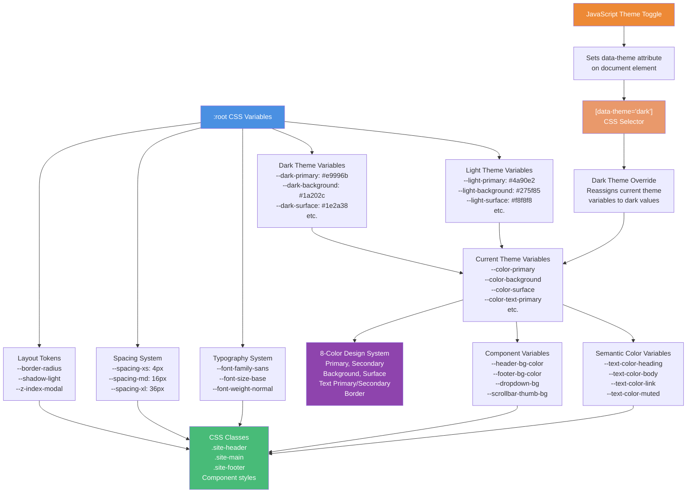

When customizing a theme, **readability** is achieved with a **contrasting color palette**.

This can be easily done by having a grayscaled theme with very different grades of Luminance (eg. black background, white letters (dark theme) or vice-versa (light theme)), end of the story. 

But if you want to add colors, the alternatives are more nuanced and myriad.

Firstly, make sure you have a local copy of the CSS variables:

```bash

mkdir -p assets/css/global/
curl -L -o assets/css/global/variables.css https://github.com/stradichenko/PKB-theme/raw/main/assets/css/global/variables.css
```

We suggest the following strategy:

Separate two contrast groups: A & B. 

Group A can be subdivided into three subgroups using `Triad`, `Split Complementary` or `Compound` Color Harmony in the `LAB` Color Mode:

For the `dark-theme`:

```
Applying the Compound Harmony and assigning each subgroup as analogous:

- Low luminance (A):
    - dark-primary & dark-secondary
    - dark-primary-variant
    - dark-background & dark-surface

Applying the Analogous Harmony

- High luminance (B):
    - dark-text-primary, dark-text-secondary & dark-border
```

For the `light-theme`:

```
- High luminance (A):
    - light-primary & light-secondary
    - light-primary-variant
    - light-background & light-surface

Applying the Analogous Harmony

- Low luminance (B):
    - light-text-primary, light-text-secondary & light-border
```

Toy with the color wheel; this will give us the base **hues**. Now, using this very useful [tool](https://oklch.com/) we could lock

In a tool that allows picking colors in a color wheel with different harmonies such as [this](https://color.adobe.com/create/color-wheel).


But to achieve this is good idea to select the proper color-space; TL;DR, we suggest using Oklab; 


## How do I pick my HUE

The initial approach we used, and the strategy to generate a amicable "palette". 
The minimal condition is that the text and the background are highly constrasting in Luminescance

https://grayscale.design/


Or you can just... do as you please, this site is your canvas.




Is a good idea to lose some Chroma to gain more Hue

--dark-secondary: #9A5B62
--dark-primary-variant: #BA97C4


1. Analogous base with low lightness
--dark-background: ;
--dark-surface: ; /* analogous and a bit higher in lumen */


Using a Square Color Harmony 
Complementary to base
- --dark-primary: 

Analogous but striking lightness compared to main
--

since --dark-primary-variant is mostly for highlighting links on hover, a reactive effect, a complementary color to --dark-primary is recommended.


Regarding -dark-text-secondary and --dark-border; anything low in luminescance and Chroma works well.


High Chroma is very opinionated
## Configuring the light theme


--light-background