+++
title = "Matomo Analytics Setup Guide"
date = 2023-06-10T09:00:00-07:00
draft = false
tags = ["analytics", "matomo", "privacy", "self-hosted", "documentation"]
categories = ["guides", "documentation"]
toc = true
description = "Comprehensive guide for setting up Matomo Analytics with your PKB-theme site"
+++

# Matomo Analytics for PKB-theme

This guide provides detailed instructions for integrating Matomo Analytics with your PKB-theme. Matomo is a powerful, privacy-focused alternative to Google Analytics that gives you complete control over your data.

## Why Choose Matomo?

Matomo (formerly Piwik) offers several advantages:

- **Full data ownership**: All data stays on your server
- **Privacy compliance**: Built-in GDPR, CCPA, and cookie law compliance tools
- **Feature parity**: Similar features to Google Analytics
- **No data limits**: Analyze unlimited websites and users
- **Customizable**: Extensive API and plugin system

## Installation Options

### Option 1: Docker Installation (Recommended)

1. **Create a docker-compose.yml file**:

```mermaid
flowchart TB
 subgraph subGraph0["PKB-theme Project"]
        PKB["/home/<USER>/projects/PKB-theme/"]
        CONFIG_TOML["config.toml<br>🔧 Analytics Configuration"]
        SEO_YML["data/seo.yml<br>🚀 Performance Config"]
  end
 subgraph subGraph1["Core Configuration"]
        DOCKER_COMPOSE["docker-compose.yml<br>🐳 Container Orchestration"]
        ENV_FILE[".env<br>🔐 Environment Variables"]
        MATOMO["/home/<USER>/projects/matomo-analytics/"]
  end
 subgraph subGraph2["Database Configuration"]
        POSTGRES_CONF["postgresql.conf<br>🗄️ Database Tuning"]
        POSTGRES_INIT["postgres-init/01-init.sql<br>📊 Database Setup"]
  end
 subgraph subGraph3["Cache Configuration"]
        REDIS_CONF["redis.conf<br>⚡ Cache Settings"]
  end
 subgraph subGraph4["Backup & Monitoring"]
        BACKUP_SCRIPT["backup-script.sh<br>💾 Database Backup"]
        MONITOR_SCRIPT["monitor-matomo.sh<br>📊 Health Check"]
  end
 subgraph subGraph5["Runtime Directories"]
        CONFIG_DIR["config/<br>📁 Matomo Config (Auto-created)"]
        LOGS_DIR["logs/<br>📋 Application Logs"]
        PLUGINS_DIR["plugins/<br>🔌 Custom Plugins"]
        BACKUPS_DIR["backups/<br>💾 Database Backups"]
  end
 subgraph subGraph6["Matomo Analytics Project"]
        subGraph1
        subGraph2
        subGraph3
        subGraph4
        subGraph5
  end
 subgraph subGraph7["System Configuration (Optional)"]
        SYSTEM["/etc/ (System Level)"]
        NGINX_CONF["/etc/nginx/sites-available/matomo-analytics<br>🌐 Reverse Proxy"]
        SYSTEMD_SERVICE["/etc/systemd/system/matomo-docker.service<br>🔄 Auto-start Service"]
        CRON_JOBS["/etc/cron.d/matomo<br>⏰ Scheduled Tasks"]
  end
 subgraph subGraph8["Project Structure"]
        subGraph0
        subGraph6
        subGraph7
  end
 subgraph subGraph9["Dependencies & Relationships"]
  end
    PKB --> CONFIG_TOML & SEO_YML
    MATOMO --> DOCKER_COMPOSE & ENV_FILE & POSTGRES_CONF & POSTGRES_INIT & REDIS_CONF & BACKUP_SCRIPT & MONITOR_SCRIPT & CONFIG_DIR & LOGS_DIR & PLUGINS_DIR & BACKUPS_DIR
    SYSTEM --> NGINX_CONF & SYSTEMD_SERVICE & CRON_JOBS
    ENV_FILE -.-> DOCKER_COMPOSE
    POSTGRES_CONF -.-> DOCKER_COMPOSE
    REDIS_CONF -.-> DOCKER_COMPOSE
    BACKUP_SCRIPT -.-> DOCKER_COMPOSE & CRON_JOBS
    POSTGRES_INIT -.-> DOCKER_COMPOSE
    DOCKER_COMPOSE -.-> CONFIG_DIR & LOGS_DIR & PLUGINS_DIR & BACKUPS_DIR
    CONFIG_TOML -.-> NGINX_CONF
    NGINX_CONF -.-> SYSTEMD_SERVICE
    MONITOR_SCRIPT -.-> CRON_JOBS
     CONFIG_TOML:::pkb
     SEO_YML:::pkb
     DOCKER_COMPOSE:::coreConfig
     ENV_FILE:::coreConfig
     POSTGRES_CONF:::dbConfig
     POSTGRES_INIT:::dbConfig
     REDIS_CONF:::cacheConfig
     BACKUP_SCRIPT:::monitoring
     MONITOR_SCRIPT:::monitoring
     CONFIG_DIR:::runtime
     LOGS_DIR:::runtime
     PLUGINS_DIR:::runtime
     BACKUPS_DIR:::runtime
     NGINX_CONF:::system
     SYSTEMD_SERVICE:::system
     CRON_JOBS:::system
    classDef coreConfig fill:#e1f5fe,stroke:#01579b,stroke-width:2px
    classDef dbConfig fill:#f3e5f5,stroke:#4a148c,stroke-width:2px
    classDef cacheConfig fill:#fff3e0,stroke:#e65100,stroke-width:2px
    classDef monitoring fill:#e8f5e8,stroke:#1b5e20,stroke-width:2px
    classDef runtime fill:#fce4ec,stroke:#880e4f,stroke-width:2px
    classDef system fill:#fff8e1,stroke:#f57f17,stroke-width:2px
    classDef pkb fill:#e0f2f1,stroke:#00695c,stroke-width:2px
```




Here are the suggested file locations and names for each configuration:

## Directory tree

```bash
/home/<USER>/projects/
├── PKB-theme/
│   ├── config.toml                    # Analytics configuration
│   └── data/
│       └── seo.yml                    # Performance & preconnect settings
│
├── matomo-analytics/
│   ├── docker-compose.yml             # Container orchestration
│   ├── .env                           # Environment variables (passwords/secrets)
│   ├── postgresql.conf                # PostgreSQL performance tuning
│   ├── redis.conf                     # Redis cache configuration
│   ├── backup-script.sh               # Database backup automation
│   ├── monitor-matomo.sh              # Health monitoring script
│   │
│   ├── config/                        # Auto-created by Matomo
│   │   └── config.ini.php             # Matomo configuration (auto-generated)
│   │
│   ├── logs/                          # Application logs directory
│   │   └── (log files...)
│   │
│   ├── plugins/                       # Custom Matomo plugins
│   │   └── (plugin files...)
│   │
│   ├── backups/                       # Database backup storage
│   │   └── (backup files...)
│   │
│   └── postgres-init/                 # PostgreSQL initialization
│       └── 01-init.sql                # Database setup script
│
└── (other projects...)

/etc/                                  # System-level configuration
├── nginx/
│   └── sites-available/
│       └── matomo-analytics           # Nginx reverse proxy config
│
├── systemd/
│   └── system/
│       └── matomo-docker.service      # Auto-start service
│
└── cron.d/
    └── matomo                         # Scheduled tasks (archiving/monitoring)
```

## FIle Creation Commands
```bash
# 1. Create main directory structure
mkdir -p /home/<USER>/projects/matomo-analytics/{config,logs,plugins,backups,postgres-init}

# 2. Create core configuration files
touch /home/<USER>/projects/matomo-analytics/.env
touch /home/<USER>/projects/matomo-analytics/docker-compose.yml
touch /home/<USER>/projects/matomo-analytics/postgresql.conf
touch /home/<USER>/projects/matomo-analytics/redis.conf

# 3. Create scripts
touch /home/<USER>/projects/matomo-analytics/backup-script.sh
touch /home/<USER>/projects/matomo-analytics/monitor-matomo.sh

# 4. Create PostgreSQL init script
touch /home/<USER>/projects/matomo-analytics/postgres-init/01-init.sql

# 5. Set permissions for scripts
chmod +x /home/<USER>/projects/matomo-analytics/backup-script.sh
chmod +x /home/<USER>/projects/matomo-analytics/monitor-matomo.sh

# 6. System files (require sudo)
sudo touch /etc/nginx/sites-available/matomo-analytics
sudo touch /etc/systemd/system/matomo-docker.service
sudo touch /etc/cron.d/matomo

# 7. <YOUR-SITE> integration (files already exist, just need modification)
# Edit: /home/<USER>/projects/<YOUR-SITE>/config/_default/hugo.toml
# Edit: /home/<USER>/projects/<YOUR-SITE>/data/seo.yml
```

```bash
# Copy the theme files to modify:
curl -L -o config/_default/params.toml https://github.com/stradichenko/PKB-theme/raw/main/config/_default/params.toml
curl -L -o data/seo.yml https://github.com/stradichenko/PKB-theme/raw/main/data.seo.yml
```


## File Locations and Names
**Suggested File Location:** <details> <summary><code>/home/&lt;USER&gt;/projects/matomo-analytics/docker-compose.yml</code></summary>

```yaml
version: '3.8'

services:
  matomo:
    image: matomo:5-apache
    restart: unless-stopped
    # COMMENT: Removed full volume mount to avoid conflicts with specific subfolder mounts
    # volumes:
    #   - matomo_data:/var/www/html
    volumes:
      # Use individual volume binds for clarity and control
      - ./config:/var/www/html/config:rw
      - ./logs:/var/www/html/logs:rw
      - ./plugins:/var/www/html/plugins:rw
    environment:
      - MATOMO_DATABASE_HOST=db
      - MATOMO_DATABASE_ADAPTER=pdo_pgsql
      - MATOMO_DATABASE_TABLES_PREFIX=matomo_
      - MATOMO_DATABASE_USERNAME=matomo
      - MATOMO_DATABASE_PASSWORD=${DB_PASSWORD}
      - MATOMO_DATABASE_DBNAME=matomo
      - MATOMO_DATABASE_PORT=5432
      - MATOMO_GENERAL_SALT=${MATOMO_SALT}
      # MODIFY: Adjust based on your traffic
      - PHP_MEMORY_LIMIT=768M  # Increase from 512M
      - PHP_MAX_EXECUTION_TIME=300
      - PHP_UPLOAD_MAX_FILESIZE=50M
      - PHP_POST_MAX_SIZE=50M
      # ADD: These missing critical settings
      - MATOMO_ASSUME_SECURE_PROTOCOL=1
      - MATOMO_FORCE_SSL=1
      - MATOMO_PROXY_CLIENT_HEADERS=HTTP_X_FORWARDED_FOR,HTTP_X_REAL_IP
      - MATOMO_PROXY_HOST_HEADERS=HTTP_X_FORWARDED_HOST
      - MATOMO_TRUSTED_HOSTS=analytics.yourdomain.com,localhost # <<--- Adjust this
      # MODIFY: Redis connection details
      - MATOMO_CACHE_BACKEND=redis
      - MATOMO_CACHE_HOST=redis
      - MATOMO_CACHE_PORT=6379
      - MATOMO_CACHE_DATABASE=14
    ports:
      - "127.0.0.1:8080:80"
    depends_on:
      db:
        condition: service_healthy
    healthcheck:
      # FIX: Simpler and more robust healthcheck
      test: ["CMD-SHELL", "curl -fs http://localhost || exit 1"]
      interval: 30s
      timeout: 10s
      retries: 3
    networks:
      - matomo_network
    deploy:
      resources:
        limits:
          memory: 1G
          cpus: '0.5'
        reservations:
          memory: 512M
          cpus: '0.25'
    logging:
      driver: "json-file"
      options:
        max-size: "10m"
        max-file: "3"

  db:
    image: postgres:16-alpine
    restart: unless-stopped
    volumes:
      # COMMENT: Removed PGDATA mismatch
      # - db_data:/var/lib/postgresql/data
      # CHANGED: Explicit pgdata subfolder for clarity with PGDATA
      - db_data:/var/lib/postgresql/data/pgdata
      - ./postgres-init:/docker-entrypoint-initdb.d:ro
      - ./postgresql.conf:/etc/postgresql/postgresql.conf:ro
    environment:
      - POSTGRES_DB=matomo
      - POSTGRES_USER=matomo
      - POSTGRES_PASSWORD=${DB_PASSWORD}
      - POSTGRES_INITDB_ARGS=--encoding=UTF-8 --lc-collate=C --lc-ctype=C
      - PGDATA=/var/lib/postgresql/data/pgdata
      # ADD: PostgreSQL performance tuning
      - POSTGRES_SHARED_BUFFERS=128MB
      - POSTGRES_MAX_CONNECTIONS=100
    command:
      - postgres
      - -c
      - config_file=/etc/postgresql/postgresql.conf
    healthcheck:
      test: ["CMD-SHELL", "pg_isready -U matomo -d matomo"]
      interval: 30s
      timeout: 10s
      retries: 3
    networks:
      - matomo_network
    deploy:
      resources:
        limits:
          memory: 512M
          cpus: '0.5'
    logging:
      driver: "json-file"
      options:
        max-size: "10m"
        max-file: "3"

  redis:
    image: redis:7-alpine
    restart: unless-stopped
    volumes:
      - redis_data:/data
      - ./redis.conf:/usr/local/etc/redis/redis.conf:ro
    command: redis-server /usr/local/etc/redis/redis.conf
    healthcheck:
      test: ["CMD", "redis-cli", "ping"]
      interval: 30s
      timeout: 10s
      retries: 3
    networks:
      - matomo_network
    deploy:
      resources:
        limits:
          memory: 256M
          cpus: '0.25'
    logging:
      driver: "json-file"
      options:
        max-size: "10m"
        max-file: "3"

  db-backup:
    image: postgres:16-alpine
    restart: unless-stopped
    volumes:
      - ./backups:/backups
      - ./backup-script.sh:/backup-script.sh:ro
      # ADD: Backup retention script
      - ./backup-cleanup.sh:/backup-cleanup.sh:ro
    environment:
      - PGPASSWORD=${DB_PASSWORD}
      - POSTGRES_DB=matomo
      - POSTGRES_USER=matomo
      - POSTGRES_HOST=db
      # ADD: Backup configuration
      - BACKUP_RETENTION_DAYS=30
      - BACKUP_COMPRESSION=gzip
    command: >
      sh -c "
        apk add --no-cache dcron gzip &&
        echo '0 2 * * * /backup-script.sh' | crontab - &&
        echo '0 3 * * 0 /backup-cleanup.sh' | crontab - &&
        crond -f
      "
    depends_on:
      - db
    networks:
      - matomo_network

volumes:
  # COMMENT: Removed matomo_data volume because full HTML path is no longer mounted
  # matomo_data:
  db_data:
  redis_data:

networks:
  matomo_network:
    driver: bridge

# ADD: Override file for development
# Create docker-compose.override.yml for development settings
```
</details>

### Backup Strategy
**Suggested File Location:** <details> <summary><code>/home/&lt;USER&gt;/projects/matomo-analytics/docker-compose.override.yml</code></summary>

```yml
version: '3.8'

services:
  matomo:
    # Development settings
    ports:
      - "8080:80"  # Expose for development
    environment:
      - MATOMO_DEV_MODE=1
      - PHP_DISPLAY_ERRORS=1
    volumes:
      # Add development tools
      - ./dev-plugins:/var/www/html/plugins/dev:rw

  db:
    # Development database settings
    environment:
      - POSTGRES_LOG_STATEMENT=all
    ports:
      - "5432:5432"  # Expose for development tools
```
</details>


### 1. Environment Configuration
**Suggested File Location:** <details> <summary><code>/home/&lt;USER&gt;/projects/matomo-analytics/.env</code></summary>

```
DB_PASSWORD=your_secure_database_password_here
MATOMO_SALT=your_random_salt_string_here_minimum_32_characters
```
</details>


### 2. PostgreSQL Configuration
**Suggested File Location:** <details> <summary><code>/home/&lt;USER&gt;/projects/matomo-analytics/postgresql.conf</code></summary>

```conf
# PostgreSQL configuration optimized for Matomo
shared_preload_libraries = 'pg_stat_statements'
max_connections = 200
shared_buffers = 256MB
effective_cache_size = 1GB
maintenance_work_mem = 64MB
checkpoint_completion_target = 0.9
wal_buffers = 16MB
default_statistics_target = 100
random_page_cost = 1.1
effective_io_concurrency = 200
work_mem = 4MB
min_wal_size = 1GB
max_wal_size = 4GB
max_worker_processes = 8
max_parallel_workers_per_gather = 4
max_parallel_workers = 8
max_parallel_maintenance_workers = 4
```
</details>


### 3. Redis Configuration
**Suggested File Location:** <details> <summary><code>/home/&lt;USER&gt;/projectsmatomo-analytics/redis.conf</code></summary>

```
# Redis configuration for Matomo caching
maxmemory 256mb
maxmemory-policy allkeys-lru
save 900 1
save 300 10
save 60 10000
stop-writes-on-bgsave-error yes
rdbcompression yes
rdbchecksum yes
dbfilename dump.rdb
dir /data
appendonly yes
appendfilename "appendonly.aof"
appendfsync everysec
no-appendfsync-on-rewrite no
auto-aof-rewrite-percentage 100
auto-aof-rewrite-min-size 64mb
aof-load-truncated yes
aof-use-rdb-preamble yes
```
</details>

### 4. Database Backup Script
**Suggested File Location:** <details> <summary><code>/home/&lt;USER&gt;/projects/matomo-analytics/backup-script.sh</code></summary>

```bash
#!/bin/sh

# Matomo PostgreSQL backup script
BACKUP_DIR="/backups"
DATE=$(date +%Y%m%d_%H%M%S)
BACKUP_FILE="matomo_backup_${DATE}.sql.gz"

# Create backup directory if it doesn't exist
mkdir -p "$BACKUP_DIR"

# Create backup
pg_dump -h "$POSTGRES_HOST" -U "$POSTGRES_USER" -d "$POSTGRES_DB" | gzip > "$BACKUP_DIR/$BACKUP_FILE"

# Keep only last 7 days of backups
find "$BACKUP_DIR" -name "matomo_backup_*.sql.gz" -mtime +7 -delete

echo "Backup completed: $BACKUP_FILE"
```
</details>

### 5. Initial PostgreSQL Setup
**Suggested File Location:** <details> <summary><code>/home/&lt;USER&gt;/projects/matomo-analytics/postgres-init/01-init.sql</code></summary>

```sql
-- Initialize Matomo database with proper settings
ALTER DATABASE matomo SET timezone TO 'UTC';
ALTER DATABASE matomo SET log_statement TO 'none';
ALTER DATABASE matomo SET log_min_duration_statement TO 1000;

-- Create extensions for better performance
CREATE EXTENSION IF NOT EXISTS pg_stat_statements;
CREATE EXTENSION IF NOT EXISTS pg_trgm;
```
</details>

### 6. HUGO Configuration
**Suggested File Location:** <details> <summary><code>&lt;YOUR-SITE&gt;/config/_default/hugo.toml</code></summary>

```
[params.analytics]
  matomo = true
  matomoSiteId = "1"
  matomoURL = "https://analytics.yourdomain.com/"
  # Optional: Enable additional features
  matomoTrackErrors = true
  matomoEnableLinkTracking = true
  matomoRequireConsent = false  # Set to true if you need GDPR compliance
```
</details>

### 7. Reverse Proxy Configuration (Nginx)
**Suggested File Location:** <details> <summary><code>/etc/nginx/sites-available/matomo-analytics</code></summary>
**File Name:** `matomo-analytics`

```bash
server {
    listen 80;
    listen [::]:80;

    server_name analytics.yourdomain.com;  # ### CHANGE THIS to your actual subdomain

    # Redirect HTTP to HTTPS
    return 301 https://$host$request_uri;
}

server {
    listen 443 ssl http2;
    listen [::]:443 ssl http2;

    server_name analytics.yourdomain.com;  # ### CHANGE THIS to your actual subdomain

    root /var/www/html/matomo;  # ### CHANGE THIS if your Matomo files are in a different location

    index index.php;

    access_log /var/log/nginx/matomo.access.log;
    error_log /var/log/nginx/matomo.error.log;

    # SSL Certificates
    ssl_certificate /etc/letsencrypt/live/analytics.yourdomain.com/fullchain.pem; # ### CHANGE THIS to your Let's Encrypt cert path
    ssl_certificate_key /etc/letsencrypt/live/analytics.yourdomain.com/privkey.pem; # ### CHANGE THIS to your cert key path
    include /etc/letsencrypt/options-ssl-nginx.conf; # ### Optional if using Certbot
    ssl_dhparam /etc/letsencrypt/ssl-dhparams.pem;   # ### Optional if using Certbot

    # Security headers
    add_header Referrer-Policy "no-referrer-when-downgrade" always;
    add_header X-Content-Type-Options "nosniff" always;
    add_header X-Frame-Options "sameorigin" always;
    add_header X-XSS-Protection "1; mode=block" always;

    client_max_body_size 100M;

    location / {
        try_files $uri $uri/ =404;
    }

    location ~ \.php$ {
        include snippets/fastcgi-php.conf;
        fastcgi_pass unix:/run/php/php8.2-fpm.sock;  # ### CHANGE THIS if using a different PHP version
        fastcgi_param SCRIPT_FILENAME $document_root$fastcgi_script_name;
        include fastcgi_params;
    }

    location ~* \.(?:ico|css|js|gif|jpe?g|png|svg|woff2?|ttf|otf|eot)$ {
        expires 7d;
        access_log off;
        add_header Cache-Control "public";
    }

    location ~ /\.ht {
        deny all;
    }
}
```
</details>

### 8. Matomo Configuration File

*(Note: This file is auto-created by Matomo during installation)*
**Suggested File Location:** <details> <summary><code>/home/&lt;USER&gt;/projects/matomo-analytics/config/config.ini.php</code></summary>

```php
<?php
; <?php exit; ?> DO NOT REMOVE THIS LINE
; file automatically generated or modified by Matomo; you can manually override the default values in global.ini.php by redefining them in this file.
[database]
host = "db"
username = "matomo"
password = "your_db_password"
dbname = "matomo"
tables_prefix = "matomo_"
adapter = "PDO\PGSQL"
port = 5432
charset = "utf8"

[General]
salt = "your_matomo_salt"
trusted_hosts[] = "analytics.yourdomain.com"
force_ssl = 1
assume_secure_protocol = 1
proxy_client_headers[] = HTTP_X_FORWARDED_FOR
proxy_client_headers[] = HTTP_X_REAL_IP
proxy_host_headers[] = HTTP_X_FORWARDED_HOST

[Plugins]
Plugins[] = "CoreAdminHome"
Plugins[] = "CoreHome"
Plugins[] = "CoreVisualizations"
Plugins[] = "Proxy"
Plugins[] = "API"
Plugins[] = "Widgetize"
Plugins[] = "Transitions"
Plugins[] = "LanguagesManager"
Plugins[] = "Actions"
Plugins[] = "Dashboard"
Plugins[] = "MultiSites"
Plugins[] = "Referrers"
Plugins[] = "UserLanguage"
Plugins[] = "DevicesDetection"
Plugins[] = "Goals"
Plugins[] = "Ecommerce"
Plugins[] = "SEO"
Plugins[] = "Events"
Plugins[] = "UserCountry"
Plugins[] = "GeoIp2"
Plugins[] = "VisitsSummary"
Plugins[] = "VisitFrequency"
Plugins[] = "VisitTime"
Plugins[] = "VisitorInterest"
Plugins[] = "RssWidget"
Plugins[] = "Feedback"
Plugins[] = "Monolog"
Plugins[] = "Login"
Plugins[] = "TwoFactorAuth"
Plugins[] = "UsersManager"
Plugins[] = "SitesManager"
Plugins[] = "Installation"
Plugins[] = "CoreUpdater"
Plugins[] = "CoreConsole"
Plugins[] = "ScheduledReports"
Plugins[] = "UserCountryMap"
Plugins[] = "Live"
Plugins[] = "PrivacyManager"
Plugins[] = "ImageGraph"
Plugins[] = "Annotations"
Plugins[] = "MobileMessaging"
Plugins[] = "Overlay"
Plugins[] = "SegmentEditor"
Plugins[] = "Insights"
Plugins[] = "Morpheus"
Plugins[] = "Contents"
Plugins[] = "BulkTracking"
Plugins[] = "Resolution"
Plugins[] = "DevicePlugins"
Plugins[] = "Heartbeat"
Plugins[] = "Intl"
Plugins[] = "Marketplace"
Plugins[] = "ProfessionalServices"
Plugins[] = "UserId"
Plugins[] = "CustomJsTracker"
Plugins[] = "Tour"

[Cache]
backend = redis
cache_backend = redis

[RedisCache]
host = "redis"
port = 6379
timeout = 0.0
password = ""
database = 14

[log]
log_writers[] = file
log_level = WARN
logger_file_path = /var/www/html/logs
```
</details>

### 9. Systemd Service for Auto-restart
**Suggested File Location:** <details> <summary><code>/etc/systemd/system/matomo-docker.service</code></summary>

```bash
[Unit]
Description=Matomo Analytics Docker Compose
Requires=docker.service
After=docker.service

[Service]
Type=oneshot
RemainAfterExit=yes
WorkingDirectory=/path/to/your/matomo/directory
ExecStart=/usr/bin/docker-compose up -d
ExecStop=/usr/bin/docker-compose down
TimeoutStartSec=0

[Install]
WantedBy=multi-user.target
```
</details>

### 10. Monitoring Script
**Suggested File Location:** <details> <summary><code>/home/&lt;USER&gt;/projects/matomo-analytics/monitor-matomo.sh</code></summary>

```bash
#!/bin/bash

# Matomo health monitoring script
MATOMO_URL="https://analytics.yourdomain.com/matomo.php"
HEALTHCHECK_URL="http://127.0.0.1:8080/matomo.php"
SLACK_WEBHOOK="your_slack_webhook_url"

# Check if Matomo is responding
if ! curl -f -s "$HEALTHCHECK_URL" > /dev/null; then
    echo "Matomo is down! Sending alert..."
    curl -X POST -H 'Content-type: application/json' \
        --data '{"text":"🚨 Matomo Analytics is DOWN! Please check the server."}' \
        "$SLACK_WEBHOOK"
    
    # Restart containers
    cd /path/to/your/matomo/directory
    docker-compose restart
fi

# Check disk space
DISK_USAGE=$(df -h /var/lib/docker | awk 'NR==2 {print $5}' | sed 's/%//')
if [ "$DISK_USAGE" -gt 85 ]; then
    echo "Disk usage is high: $DISK_USAGE%"
    curl -X POST -H 'Content-type: application/json' \
        --data "{\"text\":\"⚠️ Matomo server disk usage is at $DISK_USAGE%\"}" \
        "$SLACK_WEBHOOK"
fi
```
</details>


### 11. Cron Jobs Setup
**Suggested File Location:** <details><summary><code>/etc/cron.d/matomo</code></summary>

```bash
# Matomo archiving (every 5 minutes)
*/5 * * * * www-data /usr/bin/docker exec matomo_matomo_1 php /var/www/html/console core:archive --url=https://analytics.yourdomain.com > /dev/null 2>&1 # <--- change this

# Health check (every 5 minutes)
*/5 * * * * root /path/to/monitor-matomo.sh #<--- change this

# Log rotation (daily)
0 2 * * * root /usr/bin/docker exec matomo_matomo_1 find /var/www/html/logs -name "*.log" -mtime +30 -delete
```
</details>

---


Great, thanks for the full project layout—it gives important context. Let's break down the **SSL configuration lines** and then explain how to use **Certbot** to get the required certificates for your Nginx + Matomo setup.

---

## 🔐 Explanation of SSL lines (in `matomo-analytics` Nginx config)

```nginx
ssl_certificate /etc/letsencrypt/live/analytics.yourdomain.com/fullchain.pem; 
# ^ Full chain of your domain's SSL certificate (includes intermediate CAs)

ssl_certificate_key /etc/letsencrypt/live/analytics.yourdomain.com/privkey.pem;
# ^ Private key corresponding to the certificate above

include /etc/letsencrypt/options-ssl-nginx.conf;
# ^ Optional best-practices SSL settings file generated by Certbot

ssl_dhparam /etc/letsencrypt/ssl-dhparams.pem;
# ^ Optional strong Diffie-Hellman parameters file (for added security)
```

### 🔸 These are **required** for Nginx to support HTTPS using a **Let’s Encrypt certificate**.

---

## 🛠️ What is Certbot?


* **Certbot** is a tool that automatically obtains SSL certificates for your domain via [Let's Encrypt](https://letsencrypt.org/).
* Can automatically configure Nginx or Apache.
* Automatically renews your certificates before they expire (usually every 90 days)..

### ✅ How to set up Certbot for your Matomo project

Let’s assume your Matomo instance is **accessible via `https://analytics.example.com`** and that domain is properly pointed to your server.

### **Install Certbot and the Nginx plugin**

For Fedora:

```bash
sudo dnf install certbot python3-certbot-nginx
```

### 2. **Temporarily run Nginx without SSL**

Before Certbot can get a certificate, Nginx must be serving **HTTP (port 80)** for your domain.

Edit `/etc/nginx/sites-available/matomo-analytics` and make sure:

```nginx
server {
    listen 80;
    server_name analytics.example.com;  # Replace with your actual domain

    location / {
        proxy_pass http://localhost:PORT;  # Point to your Matomo container (check docker-compose port)
    }
}
```

Enable the site and restart Nginx:

```bash
sudo ln -s /etc/nginx/sites-available/matomo-analytics /etc/nginx/sites-enabled/
sudo nginx -t
sudo systemctl reload nginx
```


### 3. **Run Certbot**

Use Certbot to automatically get and configure SSL:

```bash
sudo certbot --nginx -d analytics.example.com
```

If successful, Certbot will:

* Obtain a free certificate from Let’s Encrypt
* Automatically update your Nginx config to use the lines like:

  ```nginx
  ssl_certificate /etc/letsencrypt/live/analytics.example.com/fullchain.pem;
  ssl_certificate_key /etc/letsencrypt/live/analytics.example.com/privkey.pem;
  ```


### 4. **Test HTTPS access**

Visit: `https://analytics.example.com`

You should see your Matomo interface with a padlock 🔒.

---

### 5. **Set up automatic renewal**

Let’s Encrypt certificates expire every 90 days. Certbot installs a systemd timer or cron job to automatically renew them.

You can manually test it with:

```bash
sudo certbot renew --dry-run
```

---

## 👀 Summary of What You Need to Change

In your Nginx config:

```nginx
# Change these placeholders:
ssl_certificate /etc/letsencrypt/live/analytics.yourdomain.com/fullchain.pem;
ssl_certificate_key /etc/letsencrypt/live/analytics.yourdomain.com/privkey.pem;

# To this (after Certbot finishes):
ssl_certificate /etc/letsencrypt/live/analytics.example.com/fullchain.pem;
ssl_certificate_key /etc/letsencrypt/live/analytics.example.com/privkey.pem;
```

In your DNS:

* Make sure `analytics.example.com` points to your server's **public IP address**
---


2. **Start the containers**:

```bash
docker-compose up -d
```

3. **Access the Matomo installer**:
   - Navigate to `http://your-server:8080`
   - Follow the installation wizard

### Option 2: Manual Installation

1. **Server requirements**:
   - Web server (Apache/Nginx)
   - PHP 7.2+ with required extensions
   - MySQL/MariaDB database

2. **Download and install**:

```bash
# Create directory
mkdir -p /var/www/matomo
cd /var/www/matomo

# Download latest Matomo
wget https://builds.matomo.org/matomo.zip
unzip matomo.zip
rm matomo.zip

# Set permissions
chown -R www-data:www-data .
```

3. **Configure your web server**:

For Nginx:

```nginx
server {
    listen 80;
    server_name analytics.yourdomain.com;
    root /var/www/matomo;
    index index.php;

    location / {
        try_files $uri $uri/ =404;
    }

    location ~ \.php$ {
        include snippets/fastcgi-php.conf;
        fastcgi_pass unix:/var/run/php/php7.4-fpm.sock;
    }

    location ~ /\.ht {
        deny all;
    }
}
```

4. **Complete the web installation**

## Configuration Best Practices

### Privacy Configuration

1. **Enable anonymization**:
   - Go to **Administration → Privacy → Anonymize data**
   - Enable IP anonymization
   - Configure tracking cookie settings

2. **Set data retention policies**:
   - Go to **Administration → Privacy → Data retention**
   - Configure how long raw data is stored

3. **Create opt-out mechanism**:
   - Go to **Administration → Privacy → Users opt-out**
   - Configure and copy the opt-out iframe code

### Performance Optimization

1. **Enable archiving**:
   - Set up the cron job for report processing:

```bash
*/5 * * * * /usr/bin/php /var/www/matomo/console core:archive --url=https://analytics.yourdomain.com > /dev/null
```

2. **Database optimization**:
   - Go to **Administration → System → Database**
   - Run the optimization routinely

3. **Consider using Redis for caching**:
   - Install the Redis Server plugin
   - Configure Redis connection

## Integrating Matomo with PKB-theme

1. **Get your tracking code**:
   - In Matomo, go to **Administration → Tracking Code**
   - Note your Site ID and Matomo URL

2. **Configure your site**:
   - Add Matomo settings to your site's `config.toml`:

```toml
[params.analytics]
  matomo = true
  matomoSiteId = "1"
  matomoURL = "https://analytics.yourdomain.com/"
```

### Advanced Tracking Features

Matomo offers various advanced tracking features:

1. **Custom dimensions**:
   - Go to **Administration → Custom Dimensions**
   - Create dimensions for tracking additional data

```javascript
// Example: track user type
_paq.push(['setCustomDimension', 1, 'member']);
```

2. **Event tracking**:
   - Track user interactions:

```javascript
// Format: trackEvent(category, action, name, value)
_paq.push(['trackEvent', 'Download', 'PDF', 'whitepaper.pdf', 1]);
```

3. **Content tracking**:
   - Track which parts of your content are visible and clicked:

```javascript
_paq.push(['enableContentTracking', true]);
```

## Viewing and Analyzing Data

### Key Reports

1. **Visitors Overview**: Real-time and historical visitor data
2. **Behavior**: Page views, entry/exit pages, site search
3. **Acquisition**: Referrers, campaigns, search engines
4. **Custom Reports**: Create reports with dimensions important to you

### Creating Custom Dashboards

1. Go to **Dashboard → Dashboard Manager**
2. Click **Create new dashboard**
3. Add widgets that display your most important metrics

## Security Considerations

1. **Secure your Matomo installation**:
   - Use HTTPS
   - Set up HTTP basic authentication
   - Configure proper file permissions

2. **Regular updates**:
   - Stay current with security updates:

```bash
# For Docker:
docker-compose pull
docker-compose up -d

# For manual installations:
cd /var/www/matomo
php console core:update
```

## Troubleshooting

### Common Issues and Solutions

1. **No data being tracked**:
   - Verify tracking code installation
   - Check for JavaScript errors
   - Look for ad blockers or tracking blockers

2. **High server load**:
   - Set up proper archiving via cron
   - Increase PHP memory limits
   - Consider database optimization

3. **Missing data**:
   - Check tracking permissions
   - Verify proper SSL configuration
   - Test for JavaScript conflicts

## Conclusion

With Matomo properly set up, you gain powerful analytics capabilities while maintaining full control over your data and respecting visitor privacy. The integration with PKB-theme makes the setup process straightforward, allowing you to focus on analyzing data and improving your site rather than managing infrastructure.
