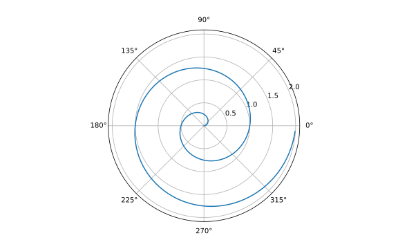
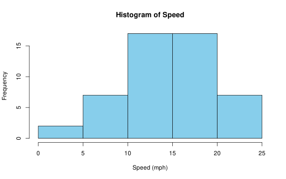
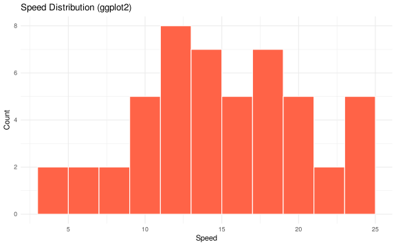

## Polar Axis (Python)

A line plot on a polar axis.

<details class="code-fold">
<summary>Code</summary>

``` python
import numpy as np
import matplotlib.pyplot as plt

r = np.arange(0, 2, 0.01)
theta = 2 * np.pi * r
fig, ax = plt.subplots(subplot_kw={'projection': 'polar'})
ax.plot(theta, r)
ax.set_rticks([0.5, 1, 1.5, 2])
ax.grid(True)
plt.show()
```

</details>


## Summary Statistics (R)

Using base R to summarize the `cars` dataset:

<details class="code-fold">
<summary>Code</summary>

``` r
summary(cars)
```

</details>

         speed           dist       
     Min.   : 4.0   Min.   :  2.00  
     1st Qu.:12.0   1st Qu.: 26.00  
     Median :15.0   Median : 36.00  
     Mean   :15.4   Mean   : 42.98  
     3rd Qu.:19.0   3rd Qu.: 56.00  
     Max.   :25.0   Max.   :120.00  

## Histogram in R

A basic histogram using base R:

<details class="code-fold">
<summary>Code</summary>

``` r
hist(cars$speed, col = "skyblue", main = "Histogram of Speed", xlab = "Speed (mph)")
```

</details>



## ggplot2 Chart (R)

A modern histogram using `ggplot2`:

<details class="code-fold">
<summary>Code</summary>

``` r
library(ggplot2)

ggplot(cars, aes(x = speed)) +
  geom_histogram(binwidth = 2, fill = "tomato", color = "white") +
  labs(title = "Speed Distribution (ggplot2)", x = "Speed", y = "Count") +
  theme_minimal()
```

</details>



## Bash Output

<details class="code-fold">
<summary>Code</summary>

``` bash
echo "Quarto supports multiple languages!"
```

</details>

    Quarto supports multiple languages!
