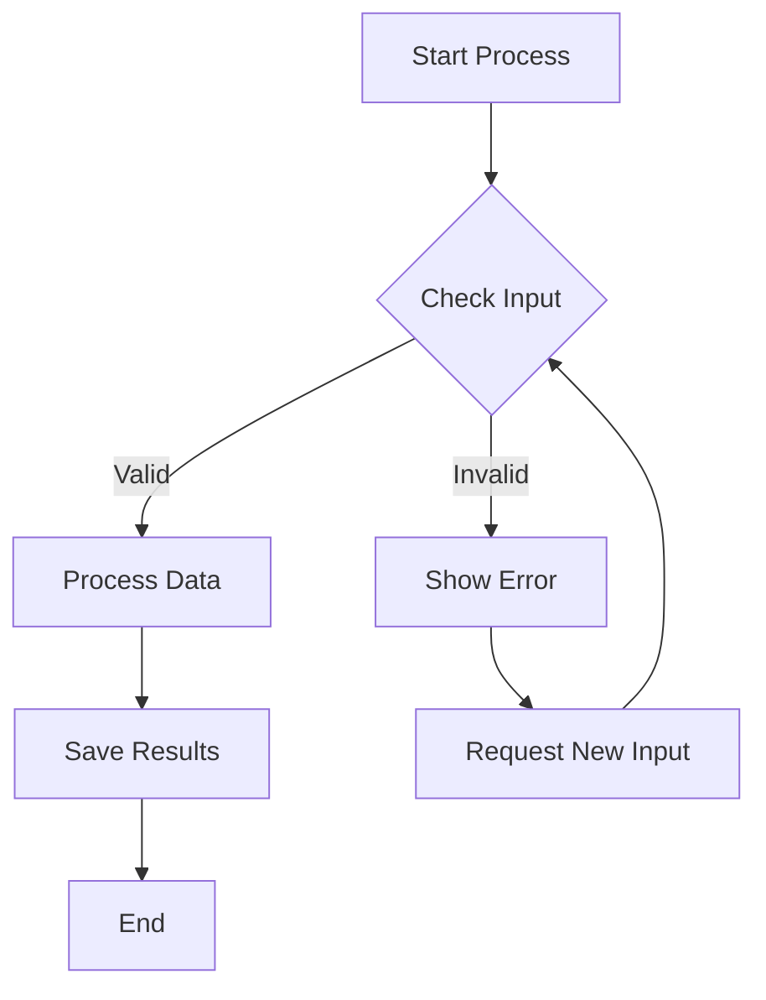
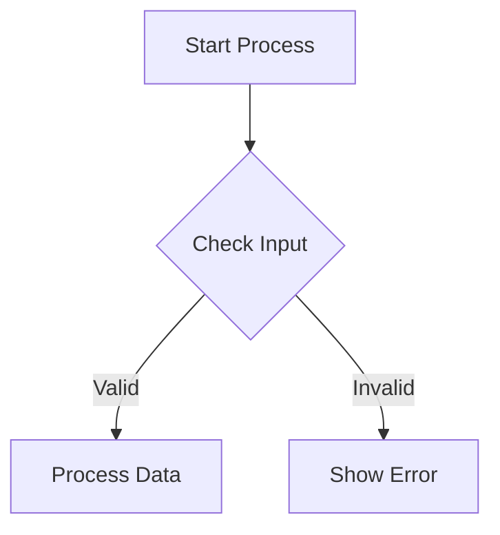
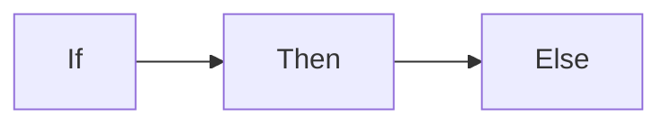
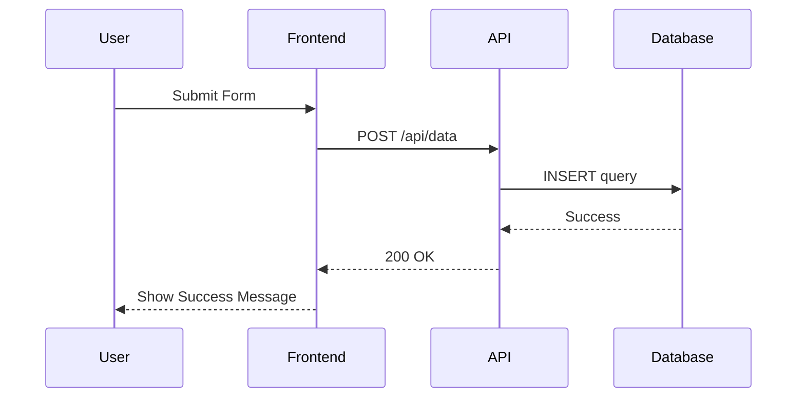
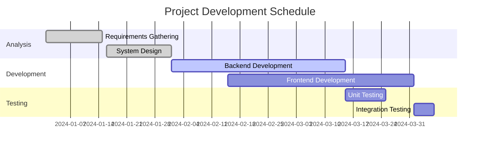
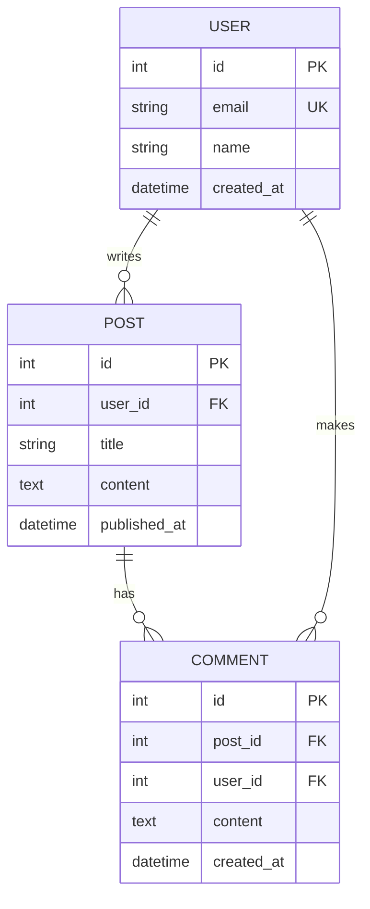
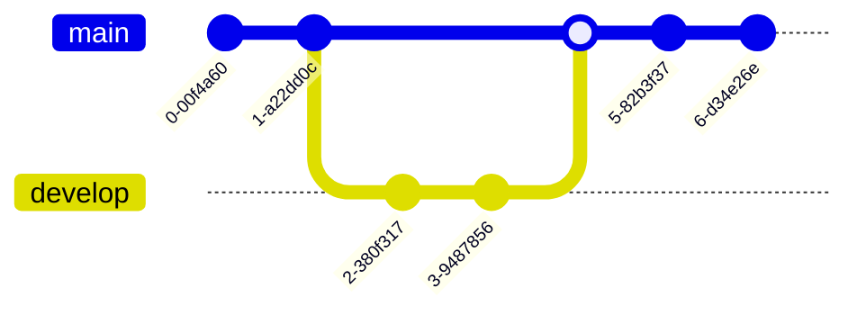

+++
title = "Markdown Boilerplate with Sidenotes"
date = 2025-02-01T09:00:00-07:00
draft = false
tags = ["documentation", "markdown", "reference", "formatting", "syntax", "writing", "guides", "content creation", "hugo", "static sites"]
categories = ["guides", "reference", "documentation", "writing", "web development"]
toc = true
sidenotes = true
comments = true
math = true
author = "Your Name"
description = "A comprehensive boilerplate showcasing all markdown features and sidenote usage"
image = "images/posts/markdown-boilerplate/sina-saadatmand-gB9hryu1q40-unsplash.jpg"
alt = "An image showing tradition"
+++

This document demonstrates all standard Markdown features along with proper sidenote usage. This resource is the central reference for all content creators building a [Digital Garden](/posts/digital-garden/) or implementing the [Zettelkasten Method](/posts/zettelkasten-method/).

## Basic Typography

Effective typography forms the foundation of digital writing. As explained by , consistent formatting improves readability. Recent studies  show that proper formatting significantly impacts user engagement. As demonstrated in previous research , this approach has been validated multiple times.

Modern web development has evolved significantly . This evolution continues to shape how we build websites  and manage content .

Sidenotes work great with lists to provide additional context for specific items without breaking the list flow . Pay attention to this line. Sidenotes work great with lists to provide additional context. Sidenotes work great with lists to provide additional context. Sidenotes work great with lists to provide additional context. Sidenotes work great with lists to provide additional context. Sidenotes work great with lists to provide additional context. Sidenotes work great with lists to provide additional context.

**Bold text** and *italic text* are straightforward. You can also have ***bold italic text*** and ~~strikethrough~~  **Sidenotes can contain formatting too!** Use them for supplementary information that doesn't interrupt the main text flow. . Sidenotes work great with lists to provide additional context. Sidenotes work great with lists to provide additional context. Sidenotes work great with lists to provide additional context. Sidenotes work great with lists to provide additional context. Sidenotes work great with lists to provide additional context. Sidenotes work great with lists to provide additional context.

Plain text with a sidenote. 
This is a standard sidenote. Use it for brief asides or clarifications.



For academic applications of these formatting techniques, see our [Academic Writing](/posts/academic-writing/) guide. 

## Headings

Above was an H2. Here are other levels, crucial for [content organization](/posts/content-organization/):

### H3 Heading

#### H4 Heading

##### H5 Heading

###### H6 Heading

## Lists

Lists are essential  your [Personal Knowledge Base](/posts/personal-knowledge-base/) . Lists are essential for structuring information in your PKB

### Unordered Lists

- Item one
- Item two
  - Nested item a
  - Nested item b
- Item three


Sidenotes work great with lists to provide additional context for specific items without breaking the list flow.


### Ordered Lists

1. First item
2. Second item
   1. Nested item 1
   2. Nested item 2
3. Third item

### Task Lists

- [x] Completed task
- [ ] Incomplete task
- [ ] Another task

## Links and Images

[External link](https://example.com) and [internal link](../another-post/)



Images can be further explained here without cluttering the main content.


## Code

Inline `code` is wrapped with backticks. Modern web development practices  emphasize the importance of clean, well-documented code. This has been consistently shown in the literature .

```python
# Code block with syntax highlighting
def hello_world():
    print("Hello, world!")
```


Code explanations can be placed in sidenotes, keeping the code block clean while providing context.


## Blockquotes

> This is a blockquote.
> 
> It can span multiple lines.


Provide information about the quote source or additional context here.


## Tables

| Header 1 | Header 2 | Header 3 |
|----------|----------|----------|
| Cell 1   | Cell 2   | Cell 3   |
| Cell 4   | Cell 5   | Cell 6   |

## Horizontal Rule

---

## Advanced Sidenote Usage

According to , effective content management requires careful consideration of information architecture. Recent performance studies  have shown that proper content organization significantly impacts site performance. These findings align with earlier research .

Plain text with a sidenote. 
This is a standard sidenote. Use it for brief asides or clarifications.


Complex paragraph with multiple concepts that benefit from sidenotes.
First sidenote explaining an initial concept in detail without interrupting the paragraph flow.
 The text continues here with more information that might need explanation.
Second sidenote providing additional context or examples for another concept mentioned in the same paragraph.


### Sidenotes with References

Academic-style writing often uses sidenotes for citations.¹
¹ Author, N. (2023). Title of the work. Publisher. Page 42.


## Math Expressions

This theme supports mathematical expressions using MathJax rendering. **Important**: Make sure to add `math = true` to your page's frontmatter to enable math rendering.

### Math Syntax Guidelines

**For math to render properly in Hugo:**
- Use single dollar signs `$...$` for inline math
- Use double dollar signs `$$...$$` for display (block) math
- Use single backslashes `\` for LaTeX commands (not double `\\`)
- Line breaks in equations use `\\` (double backslashes)
- Dollar signs are handled properly when delimiters match between Hugo and MathJax

### Inline Math

Inline math is wrapped with single dollar signs: $E = mc^2$, $\alpha + \beta = \gamma$, $\bar{x} = \frac{1}{n}\sum_{i=1}^{n} x_i$

Inline math integrates seamlessly with your text flow for simple expressions and variables. The syntax is `$E = mc^2$` which renders as $E = mc^2$.

### Block Math

For standalone equations, use double dollar signs:

$$
\frac{-b \pm \sqrt{b^2 - 4ac}}{2a}
$$

### Equation Arrays and Alignment

For multiple aligned equations:

$$
\begin{align}
f(x) &= (a+b)^2 \\
&= a^2 + 2ab + b^2
\end{align}
$$

### Matrices

$$
\begin{pmatrix}
a & b \\
c & d
\end{pmatrix}
\begin{bmatrix}
x \\
y
\end{bmatrix} =
\begin{bmatrix}
ax + by \\
cx + dy
\end{bmatrix}
$$

### Complex Notation

$$
\iiint_V \vec{F} \cdot d\vec{v} = \oiint_S \vec{F} \cdot d\vec{S}
$$

The above is Gauss's divergence theorem, showing volume integrals can be converted to surface integrals. Complex mathematical expressions benefit from sidenotes that explain the concepts without cluttering the formula.


### Numbered Equations

$$
\tag{1} E = mc^2
$$

### Chemical Equations

Chemical equations use standard LaTeX chemistry notation with MathJax:

$$
\mathrm{H_2O + CO_2 \rightarrow H_2CO_3}
$$

**More chemical equation examples:**

Simple reaction:
$$
\mathrm{2H_2 + O_2 \rightarrow 2H_2O}
$$

With states of matter:
$$
\mathrm{NaCl_{(s)} + H_2O_{(l)} \rightarrow Na^+_{(aq)} + Cl^-_{(aq)}}
$$

Complex reaction with charges:
$$
\mathrm{MnO_4^- + 8H^+ + 5e^- \rightarrow Mn^{2+} + 4H_2O}
$$

Equilibrium reaction:
$$
\mathrm{N_2 + 3H_2 \rightleftharpoons 2NH_3}
$$

**Chemical equation syntax tips:**
- Use `\mathrm{}` to wrap chemical formulas for proper formatting
- `\rightarrow` for reactions, `\rightleftharpoons` for equilibrium
- `^+` and `^-` for charges: `Na^+`, `Cl^-`
- `_{(s)}`, `_{(l)}`, `_{(g)}`, `_{(aq)}` for states of matter
- Subscripts use `_`: `H_2O`, `2NH_3`
- Superscripts use `^`: `Mn^{2+}`

**Troubleshooting:**
- If math doesn't render, check that `math = true` is in your frontmatter
- Ensure you're using the correct delimiters (`$` for inline, `$$` for display)
- For complex expressions, test in smaller parts first
- Check browser console for MathJax errors

## Footnotes

Standard markdown footnotes[^1] work like this.

[^1]: This is a footnote content.

## HTML in Markdown

<div style="color: blue;">
  Custom HTML can be included directly in markdown files if your renderer supports it.
</div>

## Conclusion

This boilerplate demonstrates the range of markdown features and proper sidenote usage . For practical applications and performance considerations , see our guides on Digital Gardening. As noted in seminal work , proper documentation is essential.

## Diagrams

This theme supports both Mermaid diagrams and GoAT ASCII diagrams for visualizing complex information.

### Mermaid Diagrams

Mermaid diagrams are created using fenced code blocks with the `mermaid` language identifier. They render dynamically and are perfect for interactive documentation.

#### Basic Flowchart



**Markdown source:**







Flowcharts are excellent for showing decision processes and workflows. Use rectangles for processes, diamonds for decisions, and circles for start/end points.


#### Sequence Diagram



#### Gantt Chart



#### Class Diagram

```mermaid
classDiagram
    class User {
        -String email
        -String password
        +login()
        +logout()
        +updateProfile()
    }
    class Post {
        -String title
        -String content
        -Date createdAt
        +publish()
        +archive()
    }
    class Comment {
        -String text
        -Date timestamp
        +edit()
        +delete()
    }
    
    User ||--o{ Post : creates
    Post ||--o{ Comment : has
    User ||--o{ Comment : writes
```

#### Entity Relationship Diagram



#### Git Graph



### GoAT ASCII Diagrams

GoAT diagrams use ASCII art for simple, text-based visualizations that work well in plain text environments.

#### System Architecture

```goat
                    .-----------.
                   |  Load      |
                   |  Balancer  |
                    '-----------'
                         |
          .--------------|--------------.
         |               |               |
    .---------.     .---------.     .---------.
   | Web      |    | Web      |    | Web      |
   | Server 1 |    | Server 2 |    | Server 3 |
    '---------'     '---------'     '---------'
         |               |               |
          '-------.------'-------.-------'
                   |               |
              .---------.     .---------.
             | Database |    |  Cache   |
             |  Server  |    |  Server  |
              '---------'     '---------'
```

#### Data Flow

```goat
   Input Data
       |
       v
 .-----------.
|  Validate  |
|    Data    |
 '-----------'
       |
       v
 .-----------.      .-----------.
| Transform  |---->|   Error   |
|    Data    |     | Handling  |
 '-----------'      '-----------'
       |                 |
       v                 v
 .-----------.      .-----------.
|   Store    |     |    Log    |
|  Results   |     |  Errors   |
 '-----------'      '-----------'
```

### Diagram Best Practices

**Mermaid Advantages:**
- Interactive and clickable elements
- Professional appearance
- Wide variety of diagram types
- Automatic layout and styling
- Good for complex relationships

**GoAT Advantages:**  
- Works in plain text environments
- Fast rendering (server-side)
- Copy-pasteable as ASCII art
- Minimal dependencies
- Good for simple diagrams

**Usage Guidelines:**
- Use Mermaid for complex, interactive diagrams
- Use GoAT for simple diagrams that need to work everywhere
- Both types export well to PDF
- Keep diagrams focused on one concept
- Add sidenotes to explain complex diagram elements

Diagrams are powerful tools for explaining complex concepts. Choose the right type based on your audience and medium - Mermaid for web-first content, GoAT for documentation that might be viewed as plain text.

## Gallery Slider Examples

The theme includes a powerful gallery slider component for showcasing multiple images with navigation controls, thumbnails, and captions.

### Basic Gallery

{{< gallery-slider 
  id="basic-example"
  src1="/images/docs/gallery-slider-doc/helenium-8985687_1280.jpg"
  alt1="Beautiful landscape with mountains"
  caption1="Beautiful landscape with mountains"
  src2="/images/docs/gallery-slider-doc/karsten-winegeart-AW76trwVU08-unsplash.jpg"
  alt2="Forest path in autumn colors"
  caption2="Forest path in autumn colors"
  src3="/images/docs/gallery-slider-doc/nataliya-melnychuk-V5s-XShdujI-unsplash.jpg"
  alt3="Portrait orientation example"
  caption3="Portrait orientation example"
>}}

The gallery slider supports both landscape and portrait images, automatically adjusting the layout. Navigation works via arrows, dots, thumbnails, and keyboard controls.

### Autoplay Gallery

{{< gallery-slider 
  id="autoplay-example"
  autoplay="true"
  interval="3000"
  showThumbnails="false"
  src1="/images/docs/gallery-slider-doc/pawel-czerwinski-mrCMyoadfBM-unsplash.jpg"
  alt1="Auto slide 1"
  caption1="Autoplay every 3 seconds"
  src2="/images/docs/gallery-slider-doc/plums-8932336_1280.jpg"
  alt2="Auto slide 2"
  caption2="Hover to pause autoplay"
  src3="/images/docs/gallery-slider-doc/spenser-sembrat-esoj35vCKS8-unsplash.jpg"
  alt3="Auto slide 3"
  caption3="Click navigation to restart timer"
>}}

Autoplay can be enabled with a custom interval. Thumbnails can be hidden for a cleaner look.

### Gallery with Custom Options

{{< gallery-slider 
  id="custom-example"
  showThumbnails="true"
  autoplay="false"
  src1="/images/docs/gallery-slider-doc/helenium-8985687_1280.jpg"
  alt1="Custom gallery example 1"
  caption1="Gallery with all features enabled"
  src2="/images/docs/gallery-slider-doc/karsten-winegeart-AW76trwVU08-unsplash.jpg"
  alt2="Custom gallery example 2"
  caption2="Navigate with arrows, dots, or thumbnails"
  src3="/images/docs/gallery-slider-doc/nataliya-melnychuk-V5s-XShdujI-unsplash.jpg"
  alt3="Custom gallery example 3"
  caption3="Support for both landscape and portrait"
>}}

**Gallery Features:**
- **Navigation**: Arrow keys, click arrows, dot indicators, thumbnail clicks
- **Autoplay**: Optional with customizable intervals
- **Responsive**: Adapts to different screen sizes
- **Keyboard Support**: Left/right arrow keys, Escape to close
- **Touch Support**: Swipe gestures on mobile devices
- **Accessibility**: Proper ARIA labels and keyboard navigation

The gallery component is fully accessible and works with keyboard navigation. Each image can have individual captions for better context.
>}}


Autoplay can be enabled with a custom interval. Thumbnails can be hidden for a cleaner look.

  src2="/images/docs/gallery-slider-doc/plums-8932336_1280.jpg"
  alt2="Auto slide 2"
  caption2="Hover to pause autoplay"
  src3="/images/docs/gallery-slider-doc/spenser-sembrat-esoj35vCKS8-unsplash.jpg"
  alt3="Auto slide 3"
  caption3="Click navigation to restart timer"
>}}

Autoplay can be enabled with a custom interval. Thumbnails can be hidden for a cleaner look.
