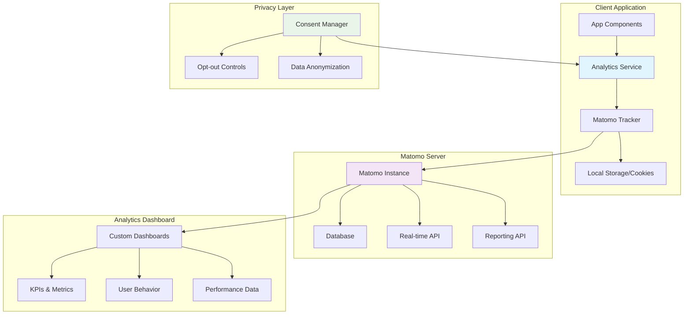

# Matomo Analytics Integration Guide

## Overview

This guide explains how to integrate Matomo analytics into our application to track user behavior, performance metrics, and business goals while maintaining privacy compliance.

## Architecture Overview



## Integration Steps

### 1. Matomo Instance Setup

**Prerequisites:**
- Matomo server instance (self-hosted or cloud)
- Site ID from Matomo admin panel
- Tracking code snippet

**Configuration:**
```javascript
// Matomo configuration object
const matomoConfig = {
    url: 'https://your-matomo-instance.com/',
    siteId: 1,
    trackErrors: true,
    enableLinkTracking: true,
    requireConsent: true
};
```

### 2. Analytics Service Layer

**Purpose:** Abstract Matomo API calls into reusable functions

**Key Functions:**
- `initializeTracking()` - Set up Matomo tracker
- `trackPageView(title, url)` - Track page navigation
- `trackEvent(category, action, name, value)` - Track user interactions
- `trackGoal(goalId, customValue)` - Track conversions
- `setUserId(userId)` - Associate actions with users
- `setCustomDimension(index, value)` - Track custom data

### 3. Page View Tracking

**Implementation Points:**
- Route changes in SPA applications
- Component mounting/unmounting
- Modal openings
- Tab switches

**Example Events:**
- `/dashboard` - Main dashboard view
- `/notes/create` - Note creation page
- `/settings` - User preferences
- `/search?q=term` - Search results

### 4. Event Tracking

**Event Categories:**
- **Navigation** - Menu clicks, breadcrumb usage
- **Content** - Note creation, editing, deletion
- **Search** - Query submissions, filter usage
- **User** - Login, logout, profile updates
- **Performance** - Load times, error rates

**Event Structure:**
```javascript
{
    category: 'Content',
    action: 'Create',
    name: 'Note',
    value: noteLength // optional numeric value
}
```

### 5. Custom Dimensions

**App-Specific Tracking:**
- User type (free, premium, admin)
- Theme preference (light, dark, auto)
- Language setting
- Device type
- Feature usage frequency

**Setup:**
1. Configure dimensions in Matomo admin
2. Map dimension IDs in application
3. Set values during user sessions

### 6. Goals and Funnels

**Conversion Goals:**
- User registration completion
- First note creation
- Premium upgrade
- Feature adoption milestones

**Funnel Analysis:**
- Onboarding flow completion rates
- Note creation workflow
- Search to action conversion

### 7. Privacy Implementation

**Consent Management:**
- Cookie consent banner
- Opt-out mechanisms
- Data retention policies
- GDPR compliance features

**Privacy Features:**
- IP anonymization
- Do Not Track header respect
- User data deletion
- Consent withdrawal

### 8. Dashboard Configuration

**Key Metrics Dashboards:**
- **User Behavior** - Page views, session duration, bounce rate
- **Feature Usage** - Most used features, adoption rates
- **Performance** - Page load times, error rates
- **Business Goals** - Conversion rates, user growth

## Implementation Checklist

### Phase 1: Basic Setup
- [ ] Install Matomo tracking code
- [ ] Configure site settings
- [ ] Test basic page view tracking
- [ ] Implement privacy controls

### Phase 2: Enhanced Tracking
- [ ] Add event tracking for key interactions
- [ ] Set up custom dimensions
- [ ] Configure user identification
- [ ] Test cross-device tracking

### Phase 3: Business Intelligence
- [ ] Define and configure goals
- [ ] Set up conversion funnels
- [ ] Create custom dashboards
- [ ] Configure automated reports

### Phase 4: Optimization
- [ ] A/B testing integration
- [ ] Performance monitoring
- [ ] Advanced segmentation
- [ ] Real-time analytics

## Data Flow

1. **User Interaction** → Component triggers analytics call
2. **Analytics Service** → Processes and enriches data
3. **Matomo Tracker** → Sends data to Matomo server
4. **Privacy Layer** → Applies consent and anonymization
5. **Matomo Server** → Stores and processes analytics data
6. **Dashboard** → Displays insights and reports

## Best Practices

### Performance
- Load Matomo script asynchronously
- Batch multiple events when possible
- Use local storage for offline queuing
- Minimize tracking payload size

### Privacy
- Always request user consent
- Provide clear opt-out mechanisms
- Anonymize personal data
- Regular data cleanup

### Data Quality
- Validate event parameters
- Use consistent naming conventions
- Filter out bot traffic
- Regular data audits

## Troubleshooting

### Common Issues
- **Tracking not working** - Check site ID and URL configuration
- **Events not appearing** - Verify event structure and timing
- **Privacy conflicts** - Review consent implementation
- **Performance impact** - Optimize tracking code placement

### Debugging Tools
- Browser developer tools network tab
- Matomo real-time visitor log
- Analytics service debug mode
- Custom logging for tracking calls

## Resources

- [Matomo Developer Guide](https://developer.matomo.org/)
- [JavaScript Tracking Client](https://developer.matomo.org/guides/tracking-javascript-guide)
- [Privacy Best Practices](https://matomo.org/privacy/)
- [Custom Dimensions Guide](https://matomo.org/docs/custom-dimensions/)
